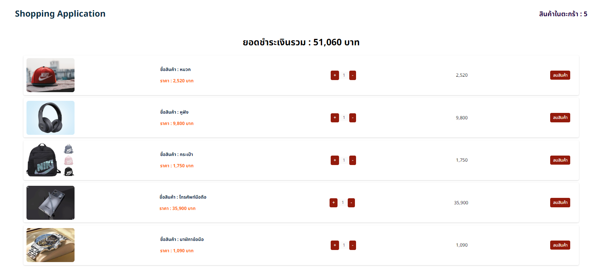

# Shopping-Application

Web application for training in using React Context & Reducers by simulating purchasing products through the website, adding products, deleting products from the shopping cart. and the total amount of products in the cart Total amount to be paid, etc.

Links Solution URL: [https://github.com/hedisnice/Shopping-Application]

Live Site URL: [https://shopping-by-nice.netlify.app/]
